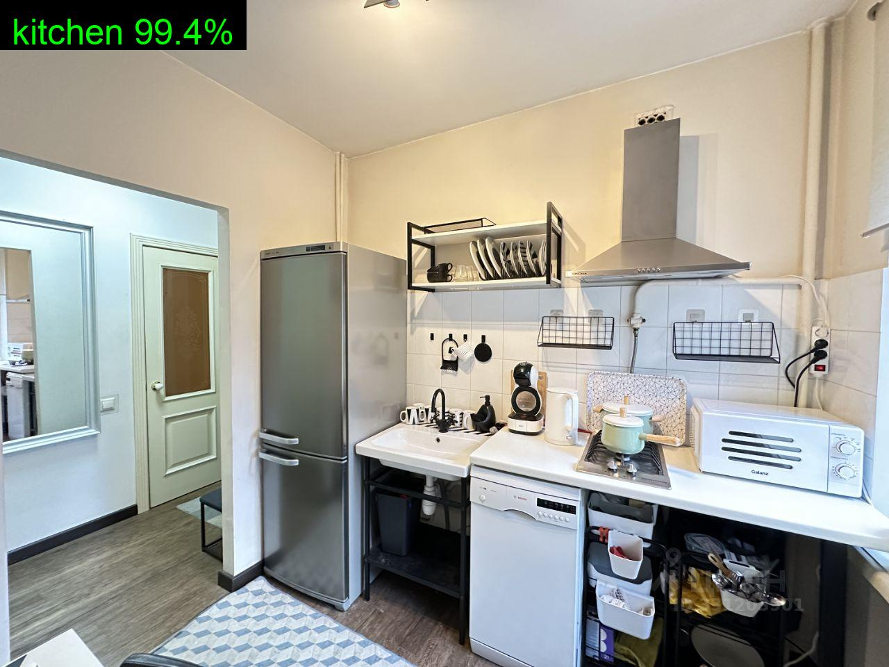
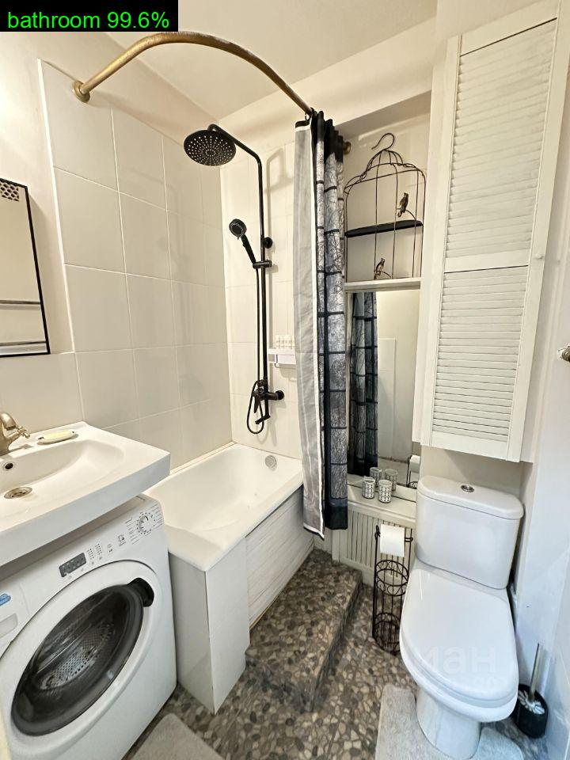
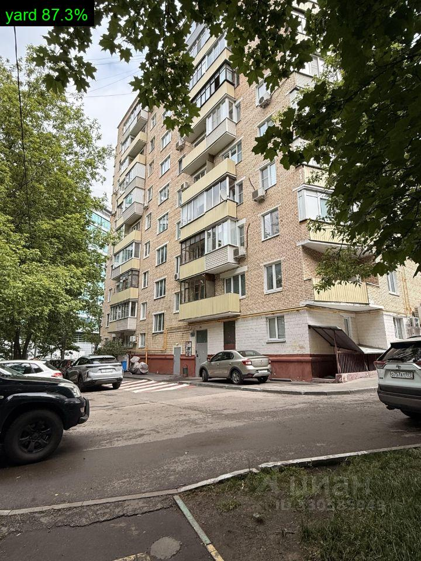
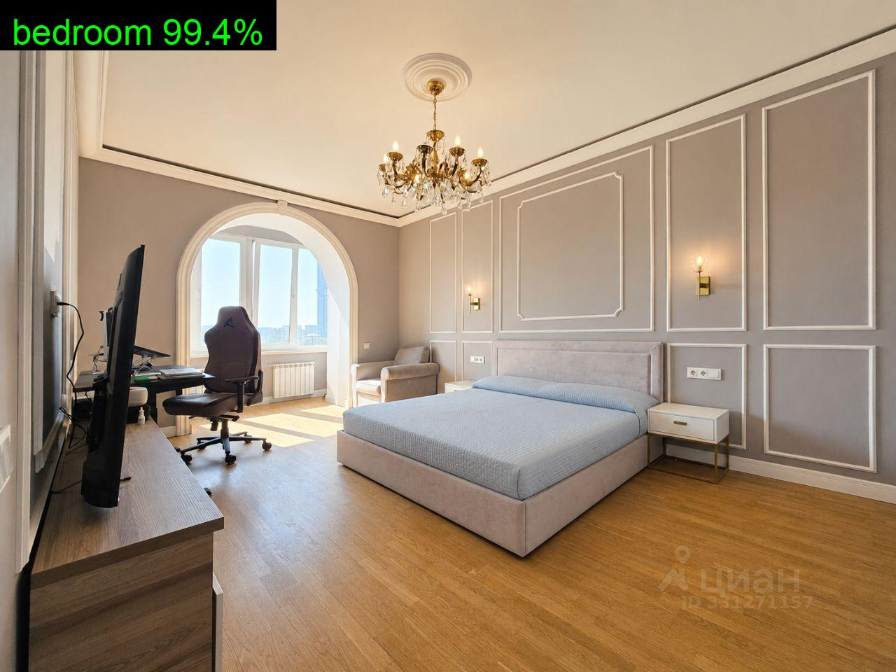
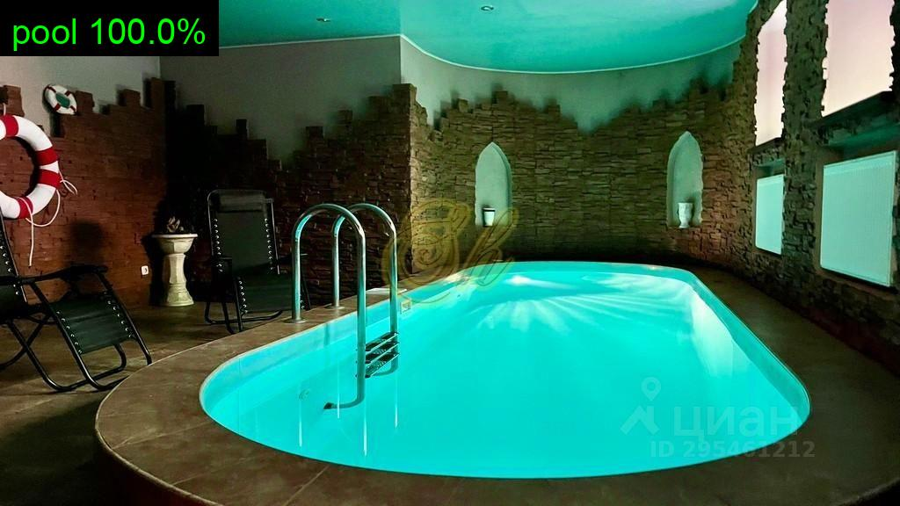
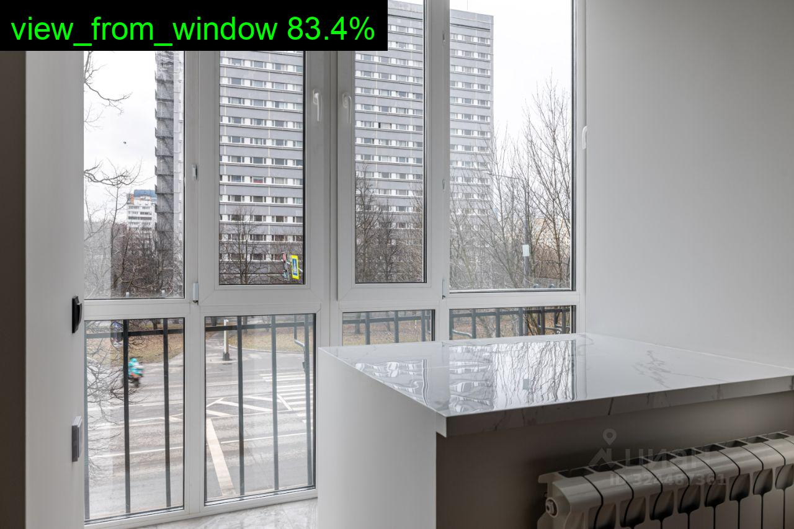

# Room Classification v1

Модель для классификации комнат и внешних зон зон на фотографиях недвижимости с помощью модели **YOLO**.

Модель определяет тип комнаты или пространства на изображении и относит его к одному из **7 классов**.

Модель была обучена на данных 2+ млн фотографий

## Классы

| Класс | Описание |
|-------|----------|
| `bathroom` | Ванная комната, санузел |
| `bedroom` | Спальня |
| `kitchen` | Кухня |
| `other` | Прочие помещения (гостиная, коридор, кабинет и т.д.) и все что не относится к жилью|
| `pool` | Бассейн |
| `view_from_window` | Вид из окна |
| `yard` | Двор, участок, внешняя территория |

## Структура проекта

```
room_classification_v1/
├── model/
│   └── yolo_cls_room.pt   # веса обученной модели
├── photos/
│   └── test1.jpg … test6.jpg  # тестовые фото
├── outputs/               # результаты с наложенными метками
├── predict.py             # скрипт инференса
├── requirements.txt
└── README.md
```

## Установка

```bash
python3 -m venv .venv
source .venv/bin/activate
pip install -r requirements.txt
```

## Инференс

Одно изображение:

```bash
python predict.py --model model/yolo_cls_room.pt --source photos/test1.jpg
```

Все тестовые фото:

```bash
python predict.py --model model/yolo_cls_room.pt --source photos --out outputs
```

Результаты сохраняются в `outputs/` — на каждое фото накладывается метка класса и confidence.

## Примеры результатов

В будущем будет добавлен бенчмарк, но на текущий момент это лучшее решение по внутренним тестам среди опенсорс проектов

| Фото | Предсказание | Confidence |
|------|-------------|------------|
| test1.jpg | kitchen | 99.4% |
| test2.jpg | bathroom | 99.6% |
| test3.jpg | yard | 87.3% |
| test4.jpg | bedroom | 99.4% |
| test5.jpg | pool | 100.0% |
| test6.jpg | view_from_window | 83.4% |

### kitchen — 99.4%



### bathroom — 99.6%



### yard — 87.3%



### bedroom — 99.4%



### pool — 100.0%



### view_from_window — 83.4%



## Лицензия

TBD
